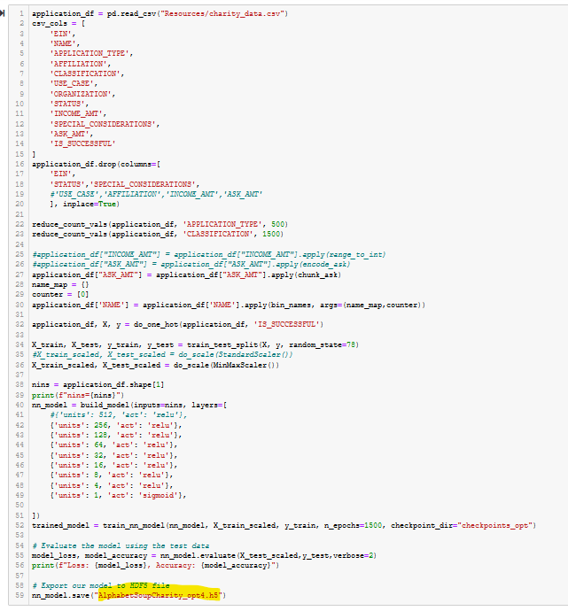
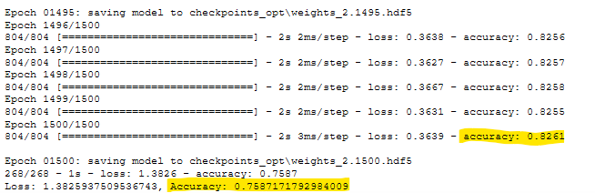
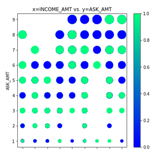
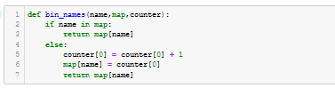
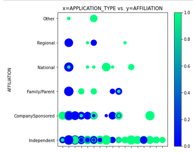
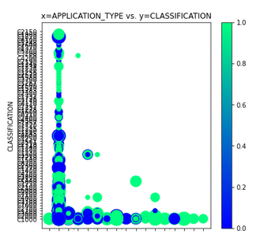
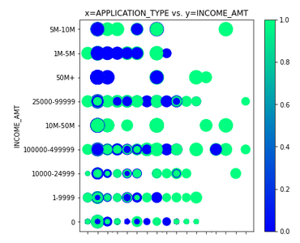
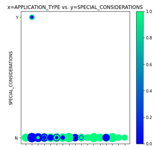
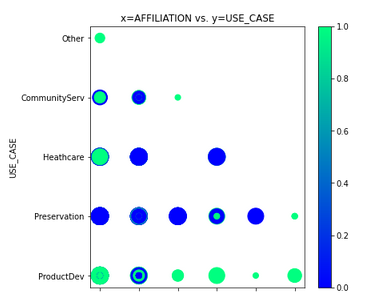
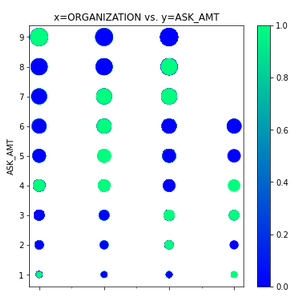

# Neural_Network_Charity_Analysis

## Overview

With our knowledge of machine learning and neural networks, we used the features in the provided dataset to create a binary classifier that is capable of predicting whether applicants will be successful if funded by Alphabet Soup.

From Alphabet Soup’s business team, we received a CSV containing more than 34,000 organizations that have received funding from Alphabet Soup over the years. Within this dataset are a number of columns that capture metadata about each organization, such as the following:

    - EIN and NAME—Identification columns
    - APPLICATION_TYPE—Alphabet Soup application type
    - AFFILIATION—Affiliated sector of industry
    - CLASSIFICATION—Government organization classification
    - USE_CASE—Use case for funding
    - ORGANIZATION—Organization type
    - STATUS—Active status
    - INCOME_AMT—Income classification
    - SPECIAL_CONSIDERATIONS—Special consideration for application
    - ASK_AMT—Funding amount requested
    - IS_SUCCESSFUL—Was the money used effectively

###### Technologies Used:

- TensorFlow
- Keras and Keras-Tuner
- Scikit-learn
- Pandas
- Jupyter notebook
- Google Colaboratory
- MatplotLib and PyPlot

## Results

Detailed screenshots of every step in the flow are in the **Appendix** below.

###### Data Preprocessing:
- What variable(s) are considered the target(s) for your model?

    | Target |
    | :-- |
    | IS_SUCCESSFUL |

- What variable(s) are considered to be the features for your model?

    | Feature | Modification |
    | :--     | :-- |
    | NAME - was originally dropped from the DataFrame because the instructions said so, but later discovered that this feature was critical for achieving accuracy above 75% | bin_names() See Fig A33 |
    | APPLICATION_TYPE | reduce_count_vals() See Fig A22 |
    | AFFILIATION | |
    | CLASSIFICATION | reduce_count_vals() See Fig A22 |
    | USE_CASE | |
    | ORGANIZATION | |
    | STATUS | |
    | INCOME_AMT | |
    | SPECIAL_CONSIDERATIONS | |
    | ASK_AMT | |

- What variable(s) are neither targets nor features, and should be removed from the input data?

    | Removed |
    | :-- |
    | EIN |

###### Compiling, Training, and Evaluating the Model

- How many neurons, layers, and activation functions did you select for your neural network model, and why?

    | Run | Neurons per Layer | Layers | Act Functions | Scaling |
    | :-- | :-- | --: | --: | --: |
    | Del. 1 |
    | Del. 2 | 80/30/1 | 3 | r/r/s | StandardScaler |
    | Del. 3 Opt1 | 340/170/85/40/40/20/5/1 | 8 | t/t/t/t/s/s/s | StandardScaler |
    | Del. 3 Opt2 | 340/170/85/40/40/20/5/1 | 8 | r/r/r/r/s/s/s | MinMaxScaler |
    | Del. 3 Opt3 (KerasTuner) | various | various | various |StandardScaler |
    | Del. 3 Opt4 | 256/128/64/32/16/8/4/1 | 8 |r/r/r/r/r/r/r/s | MinMaxScaler |

- Were you able to achieve the target model performance?

    - Eventually, in Optimization Run 4, but only after adding the 'Name' column back to the Features, and binning it. The Challenge instructions clearly said to remove the EIN and Name column.

- What steps did you take to try and increase model performance?

    - I tried just about everything:

        - Reduced the number of unique values for several features (APPLICATION_TYPE, CLASSIFICATION).
        - Converted numeric ranges presented as strings (INCOME_AMT), back into integer values.
        - Binned integer values (ASK_AMT) back into numeric ranges presented as strings (so that they could be one-hot encoded)
        - Scaled values.
        - Used Keras Tuner to automate the selection of HyperParameters.
        - Increased the number of epochs used in training to very high values.
        - The most important step was putting the Name column back into the features, mapping names to integers, and binning them.

#### Deliverable 1 - Preprocessing Data for a Neural Network Model

Using our knowledge of Pandas and the Scikit-Learn’s StandardScaler(), we preprocessed the dataset in order to compile, train, and evaluate the neural network model later in Deliverable 2.

Steps:

1. Read in the charity_data.csv to a Pandas DataFrame. See Figure A1.
2. Drop the EIN and NAME columns. See Figure A2.
3. Determine the number of unique values for each column. See Figure A3.
4. Look at APPLICATION_TYPE value counts for binning. See Figure A4.
5. Visualize the value counts of APPLICATION_TYPE. See Figure A5.
6. Determine which values to replace if counts are less than ...? See Figure A6.
7. Look at CLASSIFICATION value counts for binning. See Figure A7.
8. Visualize the value counts of CLASSIFICATION. See Figure A8.
9. Determine which values to replace if counts are less than ..? See Figure A9.
10. Generate our categorical variable lists. See Figure A10.
11. Create a OneHotEncoder instance. See Figure A11.
12. Merge one-hot encoded features and drop the originals. See Figure A12.
13. Split our preprocessed data into features, target, train, and test arrays. See Figure A13.
14. Create a StandardScaler instances. See Figure A14.

The merged_df dataframe, which is the result of preprocessing of the charity_data.csv file, is shown in Figure 1 (and A12), and is the checkpoint for Deliverable 1.

Figure 1 - The merged_df dataframe after all preprocessing but before encoding and scaling

#### Deliverable 2 - Compile, Train, and Evaluate the Model

Using our knowledge of TensorFlow, we designed a neural network, or deep learning model, to create a binary classification model that can predict if an Alphabet Soup–funded organization will be successful based on the features in the dataset. Then we compiled, trained, and evaluated our binary classification model to calculate the model’s loss and accuracy.

Steps:

15. Define the model - deep neural net. See Figure A15.
16. Import checkpoint dependencies. See Figure A16.
17. Compile the model. See Figure A17.
18. Create a callback that saves the model's weights every epoch. See Figure A18.
19. Train the model. See Figure A19.
20. Evaluate the model using the test data. See Figure A20.
21. Export our model to HDF5 file. See Figure A21.

The output of the Neural Network Training step is shown in Figure 2 (and A19).

Figure 2 - Train the model.

The Accuracy of the model for Deliverable 2 is shown in Figure 3 (and A20).

Figure 3 - Evaluate the model using the test data.

#### Deliverable 3 - Optimize the Model

Using our knowledge of TensorFlow, we attempted to optimize our model in order to achieve a target predictive accuracy higher than 75%. This Deliverable was much harder than expected. During the execution of this task, we eventually created many Python functions to help automate the task of running and re-running the various steps, shown below.

Define Various Functions for during optimization runs:

22. reduce_count_vals(). See Figure A22.
23. do_one_hot(). See Figure A23.
24. do_scatter_plots(). See Figure A24.
25. do_scale(). See Figure A25.
26. build_model(). See Figure A26.
27. train_nn_model(). See Figure A27.
28. range_to_int(). See Figure A28.
29. chunk_ask(). See Figure A29.
30. encode_ask(). See Figure A30.
31. create_tuner_model(). See Figure A31.
32. run_keras_tuner(). See Figure A32.
33. bin_names(). See Figure A33.

Do the Optimization Run Steps:

34. Optimization Run 1 Code. See Figure A34.
35. Optimization Run 1 Results. See Figure A35.
36. Optimization Run 2 Code. See Figure A36.
37. Optimization Run 2 Results. See Figure A37.
38. Optimization Run 3 (with Keras Tuner) Code and Results. See Figure A38.
39. Optimization Run 3 Best HyperParameters. See Figure A39.
40. Optimization Run 3 Best Models. See Figure A40.
41. Optimization Run 4 Code. See Figure A41.
42. Optimization Run 4 Results. See Figure A42.

It requirement was to get >75% accuracy, using at least three optimization techniques. None of the obvious optimization methods acheived an accuracy above ~74% -- not even using Keras Tuner or a very large number of epochs. When this project was almost completed, in failure, the instructor gave a hint about the 'Name' column in the input data. This seemed odd, since the Challenge instructions clearly said to remove the EIN and Name columns. A quick check with awk, sort, uniq, grep, etc. showed that there were many rows in the CSV file which had unique Employer Identification Numbers (EINs), but non-unique names. This might be an indicator of fraud, where a person or group repeatedly applied for funds from the charity using the same Name, but using falsified EINs.

It was a simple matter to write a small function called bin_names() which transformed the string version of the Name column into unique integers. This created a binning effect, where all the occurrances of a name (e.g. 'John Doe') were labeled with the same integer. So even though our John Doe might have used 100 different EINs, one for each funding request, the neural network was able to single that person out. Then that applicant could be analyzed based on their history of success/failure in the 'IS_SUCCESSFUL' data column. This technique, combined with a very large number of training epochs, eventually resulted in an accuracy of >75%. Note however, that the there are two conflicting accuracies in Figure 5. The higher 82.67% accuracy was reported during the training/fitting process, but the result of the evaluate step was only 75.87%. It's not clear what caused this discrepancy.

The code for Optimization Run 4 is shown in Figure 4 (and A41).

Figure 4 - Optimization Run 4 Code.

Figure 5 - Optimization Run 4 Results.

## Summary

This project covered:
- Data preprocessing for use with neual networks.
- Neural network creation, training, and evaluation.
- Neural network optimation.
- Automating the process with Keras Tuner.
- Going back and verifying assumptions.

**Recommendation**: It would be a good idea to investigate RandomForest and SVM Models

The provided data (charity_data.csv) was very difficult for our neural network to classify with any accuracy above ~73%. The main problem was 'confounding factors'. As shown in Figure 6 (and Figures A43 - A29 below), the data did not have clear clustered boundaries between success (green) and failure (blue). It's also clear that some columns in the CSV file (e.g. SPECIAL_CONSIDERATIONS) have no diagnostic value, as shown in Figure A46, and they were removed from that optimization run.

Figure 5 - Scatter plot of INCOME vs. ASK_AMT (point size is proportional to ASK_AMT)

Scatter Plots:

43. APPLICATION_TYPE vs. AFFILIATION. See Figure A43
44. APPLICATION_TYPE vs. AFFILIATION. See Figure A44
45. APPLICATION_TYPE vs. INCOME. See Figure A45
46. APPLICATION_TYPE vs. SPECIAL_CONSIDERATIONS. See Figure A46
47. AFFILIATION vs. USE_CASE. See Figure A47
48. ORGANIZATION vs. ASK_AMT. See Figure A48
49. INCOME vs. ASK_AMT. See Figure A49

## Appendix

In order to avoid cluttering the main body of this report, all figures and code are presented in this Appendix. Some may be duplicated in the main body of the report to illustrate major points.

###### Deliverable 1

Figure A1 - Read the charity_data.csv into application_df

Figure A2 - Drop the EIN and NAME columns.

Figure A3 - Determine the number of unique values for each column.

Figure A4 - Look at APPLICATION_TYPE value counts for binning.

Figure A5 - Visualize the value counts of APPLICATION_TYPE.

Figure A6 - Determine which values to replace if counts are less than ...?

Figure A7 - Look at CLASSIFICATION value counts for binning.

Figure A8 - Visualize the value counts of CLASSIFICATION.

Figure A9 - Determine which values to replace if counts are less than ...?

Figure A10 - Generate our categorical variable lists.

Figure A11 -  Create a OneHotEncoder instance.

Figure A12 - Merge one-hot encoded features and drop the originals.

Figure A13 - Split our preprocessed data into features, target, train, and test arrays.

Figure A14 - Create a StandardScaler instances.

###### Deliverable 2

Figure A15 - Define the model - deep neural net, i.e., the number of input features and hidden nodes for each layer.

Figure A16 - Import checkpoint dependencies.

Figure A17 - Compile the model.

Figure A18 - Create a callback that saves the model's weights every epoch.

Figure A19 - Train the model.

Figure A20 - Evaluate the model using the test data.

Figure A21 - Export our model to HDF5 file.

###### Deliverable 3

Figure A22 - reduce_count_vals()

Figure A23 - do_one_hot()

Figure A24 - do_scatter_plots()

Figure A25 - do_scale()

Figure A26 - build_model()

Figure A27 - train_nn_model()

Figure A28 - range_to_int()

Figure A29 - chunk_ask()

Figure A30 - encode_ask()

Figure A31 - create_tuner_model()

Figure A32 - run_keras_tuner()

Figure A33 - bin_names()

Figure A34 - Optimization Run 1 Code

Figure A35 - Optimization Run 1 Results

Figure A36 - Optimization Run 2 Code

Figure A37 - Optimization Run 2 Results

Figure A38 - Optimization Run 3 (with Keras Tuner) Code and Results

Figure A39 - Optimization Run 3 Best HyperParameters

Figure A40 - Optimization Run 3 Best Models

Figure A41 - Optimization Run 4 Code.

Figure A42 - Optimization Run 4 Results.

Figure A43 - APPLICATION_TYPE vs. AFFILIATION.

Figure A44 - APPLICATION_TYPE vs. AFFILIATION.

Figure A45 - APPLICATION_TYPE vs. INCOME.

Figure A46 - APPLICATION_TYPE vs. SPECIAL_CONSIDERATIONS.

Figure A47 - AFFILIATION vs. USE_CASE.

Figure A48 - ORGANIZATION vs. ASK_AMT.

Figure A49 - INCOME vs. ASK_AMT.

