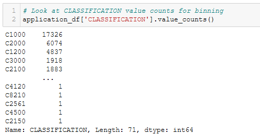
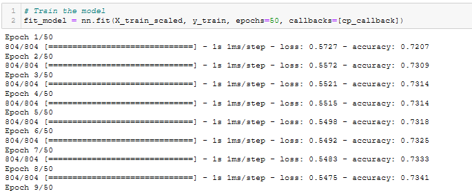

# Neural_Network_Charity_Analysis

## Overview

With our knowledge of machine learning and neural networks, we used the features in the provided dataset to create a binary classifier that is capable of predicting whether applicants will be successful if funded by Alphabet Soup.

From Alphabet Soup’s business team, we received a CSV containing more than 34,000 organizations that have received funding from Alphabet Soup over the years. Within this dataset are a number of columns that capture metadata about each organization, such as the following:

    - EIN and NAME—Identification columns
    - APPLICATION_TYPE—Alphabet Soup application type
    - AFFILIATION—Affiliated sector of industry
    - CLASSIFICATION—Government organization classification
    - USE_CASE—Use case for funding
    - ORGANIZATION—Organization type
    - STATUS—Active status
    - INCOME_AMT—Income classification
    - SPECIAL_CONSIDERATIONS—Special consideration for application
    - ASK_AMT—Funding amount requested
    - IS_SUCCESSFUL—Was the money used effectively

###### Technologies Used:

- TensorFlow
- Keras and Keras-Tuner
- Scikit-learn
- Pandas
- Jupyter notebook
- Google Colaboratory
- MatplotLib and PyPlot

## Results

Detailed screenshots of every step in the flow are in the **Appendix** below.

#### Deliverable 1 - Preprocessing Data for a Neural Network Model

Using our knowledge of Pandas and the Scikit-Learn’s StandardScaler(), we preprocessed the dataset in order to compile, train, and evaluate the neural network model later in Deliverable 2.

Steps:

1. Read in the charity_data.csv to a Pandas DataFrame. See Figure A1.
2. Drop the EIN and NAME columns. See Figure A2.
3. Determine the number of unique values for each column. See Figure A3.
4. Look at APPLICATION_TYPE value counts for binning. See Figure A4.
5. Visualize the value counts of APPLICATION_TYPE. See Figure A5.
6. Determine which values to replace if counts are less than ...? See Figure A6.
7. Look at CLASSIFICATION value counts for binning. See Figure A7.
8. Visualize the value counts of CLASSIFICATION. See Figure A8.
9. Determine which values to replace if counts are less than ..? See Figure A9.
10. Generate our categorical variable lists. See Figure A10.
11. Create a OneHotEncoder instance. See Figure A11.
12. Merge one-hot encoded features and drop the originals. See Figure A12.
13. Split our preprocessed data into features, target, train, and test arrays. See Figure A13.
14. Create a StandardScaler instances. See Figure A14.

#### Deliverable 2 - Compile, Train, and Evaluate the Model

Using our knowledge of TensorFlow, we designed a neural network, or deep learning model, to create a binary classification model that can predict if an Alphabet Soup–funded organization will be successful based on the features in the dataset. Then we compiled, trained, and evaluated our binary classification model to calculate the model’s loss and accuracy.

Steps:

15. Define the model - deep neural net. See Figure A15.
16. Import checkpoint dependencies. See Figure A16.
17. Compile the model. See Figure A17.
18. Create a callback that saves the model's weights every epoch. See Figure A18.
19. Train the model. See Figure A19.
20. Evaluate the model using the test data. See Figure A20.
21. Export our model to HDF5 file. See Figure A21.

#### Deliverable 3 - Optimize the Model

Using our knowledge of TensorFlow, we attempted to optimize our model in order to achieve a target predictive accuracy higher than 75%.

## Summary

## Appendix

In order to avoid cluttering the main body of this report, all figures and code are presented in this Appendix. Some may be duplicated in the main body of the report to illustrate major points.

###### Deliverable 1

Figure A1 - Read the charity_data.csv into application_df

Figure A2 - Drop the EIN and NAME columns.

Figure A3 - Determine the number of unique values for each column.

Figure A4 - Look at APPLICATION_TYPE value counts for binning.

Figure A5 - Visualize the value counts of APPLICATION_TYPE.

Figure A6 - Determine which values to replace if counts are less than ...?

Figure A7 - Look at CLASSIFICATION value counts for binning.

Figure A8 - Visualize the value counts of CLASSIFICATION.

Figure A9 - Determine which values to replace if counts are less than ...?

Figure A10 - Generate our categorical variable lists.

Figure A11 -  Create a OneHotEncoder instance.

Figure A12 - Merge one-hot encoded features and drop the originals.

Figure A13 - Split our preprocessed data into features, target, train, and test arrays.

Figure A14 - Create a StandardScaler instances.

###### Deliverable 2

Figure A15 - Define the model - deep neural net, i.e., the number of input features and hidden nodes for each layer.

Figure A16 - Import checkpoint dependencies.

Figure A17 - Compile the model.

Figure A18 - Create a callback that saves the model's weights every epoch.

Figure A19 - Train the model.

Figure A20 - Evaluate the model using the test data. See Figure A20.

Figure A21 - Export our model to HDF5 file. See Figure A21.

###### Deliverable 3

Figure A22 - reduce_count_vals()

Figure A23 - def_do_one_hot()

Figure A24 - def_do_scatter_plots()

Figure A25 - def_do_scale()

Figure A26 - def_build_model()

Figure A27 - def_train_nn_model()

Figure A28 - def_run_keras_tuner()

Figure A29 - def_range_to_int()

Figure A30 - def_chunk_ask()

Figure A31 - def_encode_ask()

Figure A32 - def_create_tuner_model()

Figure A33 - run_keras_tuner2()

Figure A34 - Optimization Run 1 Code

Figure A35 - Optimization Run 1 Results

Figure A36 - Optimization Run 2 Code

Figure A37 - Optimization Run 2 Results

Figure A38 - Optimization Run 3 (with Keras Tuner) Code and Results

Figure A39 - Optimization Run 3 Best HyperParameters

Figure A40 - Optimization Run 3 Best Models

